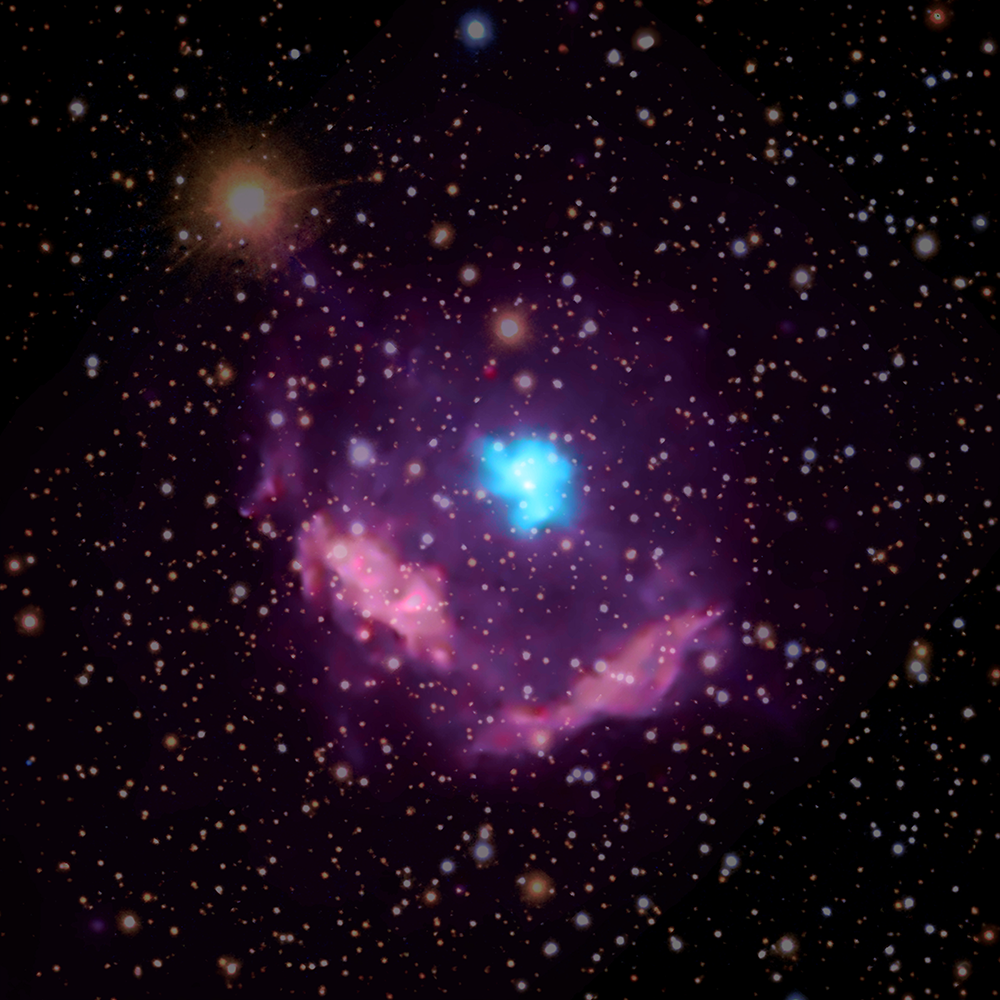

# Pulsar classification
**(Notebook: work in progress)**

A classification problem, classifying pulsar against RFI (Radio Frenquency Interference), noise or other space objects.

The database is from the **UCI Machine Learning Repository** , see [1] and can be found [here](https://archive.ics.uci.edu/ml/datasets/HTRU2). It is the result of the works from R. J. Lyon, B. W. Stappers, S. Cooper, J. M. Brooke, J. D. Knowles, see [2].

**What is a pulsar?** A special type of neutron star, the result of the collapse of a massive star. They radiate two steady, narrow beams of light in opposite directions. But because pulsar are spinning (fast! from once every second to hundreds of time per second), their light appear to blink from an observer on earth. A good introduction on pulsars can be found here [3].

Here's what a pulsar looks like. This is youngest known pulsar in the Milky Way galaxy, a remnant of supernova Kes 75.  when observed (and image )

In this composite image of Kes 75, high-energy X-rays are colored blue and highlight the pulsar wind nebula surrounding the pulsar, while lower-energy X-rays appear purple and show the debris from the explosion
(image from [nasa.gov](nasa.gov) taken by **NASA's Chandra X-ray Observatory**).

---
**References**:

**[1]** Dua, D. and Graff, C. (2019). UCI Machine Learning Repository [http://archive.ics.uci.edu/ml].
    Irvine, CA: University of California, School of Information and Computer Science.

**[2]** R. J. Lyon, B. W. Stappers, S. Cooper, J. M. Brooke, J. D. Knowles, Fifty Years of Pulsar
    Candidate Selection: From simple filters to a new principled real-time classification approach
	MNRAS, 2016.

**[3]** [what are pulsars](https://www.space.com/32661-pulsars.html)

---

